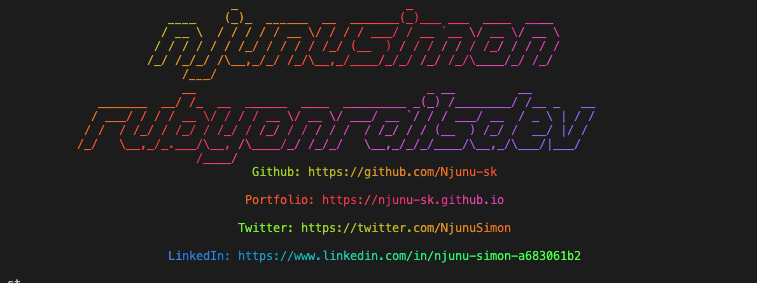

## Installation

Install the gem and add to the application's Gemfile by executing:

    $ bundle add njunusk

If bundler is not being used to manage dependencies, install the gem by executing:

    $ gem install njunusk

Then, `sudo njunusk`

## Development

After checking out the repo, run `bin/setup` to install dependencies. You can also run `bin/console` for an interactive prompt that will allow you to experiment.

## Contributing

Bug reports and pull requests are welcome on GitHub at https://github.com/[USERNAME]/njunusk. This project is intended to be a safe, welcoming space for collaboration, and contributors are expected to adhere to the [code of conduct](https://github.com/[USERNAME]/njunusk/blob/main/CODE_OF_CONDUCT.md).

## License

The gem is available as open source under the terms of the [MIT License](https://opensource.org/licenses/MIT).

## Code of Conduct

Everyone interacting in the Njunusk project's codebases, issue trackers, chat rooms and mailing lists is expected to follow the [code of conduct](https://github.com/[USERNAME]/njunusk/blob/main/CODE_OF_CONDUCT.md).

- Credit to [andrecodes](https://github.com/andrewmcodes/andrewmcodes_gem).
